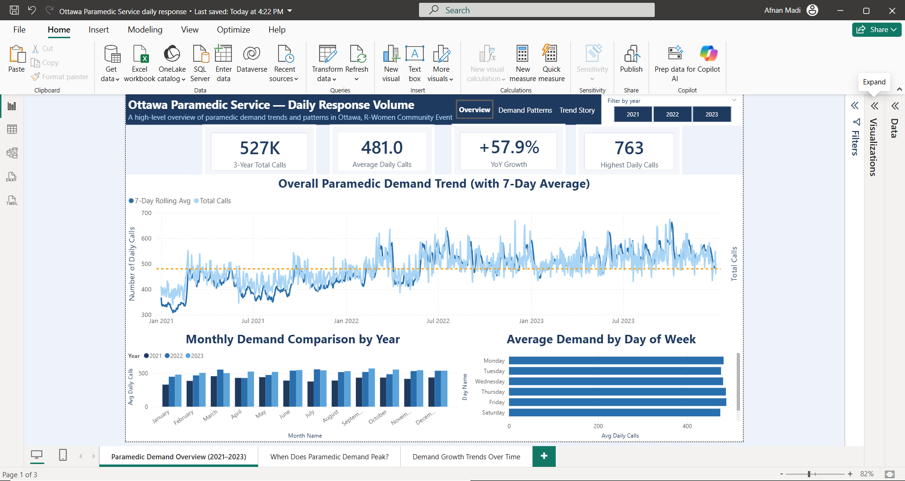
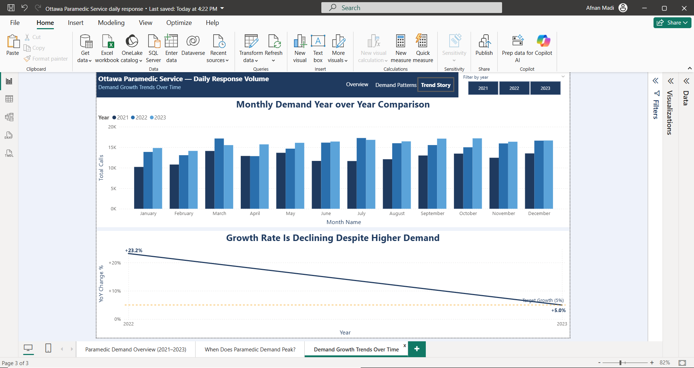

# 🚑 Ottawa Paramedic Demand Analysis (2021–2023)

---

## 📌 Project Overview
This project analyzes daily paramedic service demand in Ottawa from 2021 to 2023 using **Power BI**.

🎯 The goal of this analysis is to:
- Understand how demand changes over time  
- Identify peak demand periods  
- Explore seasonal patterns  
- Analyze year-over-year growth trends  

---

## 🎯 Live Dashboard

You can explore the interactive Power BI dashboard using filters and slicers to analyze trends, peak demand periods, and growth patterns.

👉 **[Open Power BI Dashboard](https://app.powerbi.com/links/8-_6_Kg3pt?ctid=5ca4007e-bd93-4a63-99ac-2a7e8b4dfd32&pbi_source=linkShare)**

---

## 🛠️ Tools & Technologies
- 📊 Power BI  
- 🧮 DAX  
- 📁 CSV Dataset  

---

## 📂 Dataset
- Ottawa Paramedic Service — Daily Response Volume  

---

## 🔍 Key Insights

- 📈 **Demand is increasing over time** (2021 → 2023)  
- 📅 **Fridays show the highest demand** across the week  
- 🌦️ **Seasonal patterns exist** across different months  
- 📉 **Growth rate is slowing down**, approaching planning thresholds  

---

## 📊 Dashboard Pages

### 🔹 1. Overview of Paramedic Demand

---

### 🔹 2. When Does Paramedic Demand Peak?

---

### 🔹 3. Demand Is Growing — But Growth Is Slowing Down

---

## 💡 Business Value
This dashboard provides insights that can help:
- Improve **resource allocation**
- Optimize **staffing during peak demand**
- Support **data-driven decision making**

---

## 📁 Project Structure

This repository includes the following files:

- 📊 **Power BI Dashboard**  
  `Ottawa Paramedic Service daily response.pbix`  
  → Interactive dashboard with insights and visualizations  

- 📄 **Dataset**  
  `Ottawa_Paramedic_Service_daily_response_volume.csv`  
  → Raw data used for analysis  

- 🖼️ **Dashboard Screenshots**  
  `overview.png`  
  `demand.png`  
  `trend.png`  
  → Visual previews of each dashboard page 
---

## 👩‍💻 About Me
Hi, I'm **Afnan**, a Data Analyst passionate about turning data into actionable insights 📊  

I enjoy working with:
- Data visualization  
- Business intelligence  
- Real-world data analysis  

🔗 Connect with me on LinkedIn:  
👉 https://www.linkedin.com/in/afnan-madi-40885193

---

## ⭐ If you like this project
Feel free to ⭐ the repo or connect with me!
