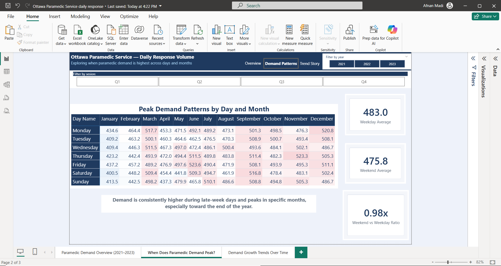

# 🚑 Ottawa Paramedic Demand Analysis (2021–2023)

---

## 📌 Project Overview
This project analyzes daily paramedic service demand in Ottawa from 2021 to 2023 using **Power BI**.

🎯 The goal of this analysis is to:
- Understand how demand changes over time  
- Identify peak demand periods  
- Explore seasonal patterns  
- Analyze year-over-year growth trends  

---

## 🛠️ Tools & Technologies
- 📊 Power BI  
- 🧮 DAX  
- 📁 CSV Dataset  

---

## 📂 Dataset
- Ottawa Paramedic Service — Daily Response Volume  

---

## 🔍 Key Insights

- 📈 **Demand is increasing over time** (2021 → 2023)  
- 📅 **Fridays show the highest demand** across the week  
- 🌦️ **Seasonal patterns exist** across different months  
- 📉 **Growth rate is slowing down**, approaching planning thresholds  

---

## 📊 Dashboard Pages

### 🔹 1. Overview of Paramedic Demand

---

### 🔹 2. When Does Paramedic Demand Peak?

---

### 🔹 3. Demand Is Growing — But Growth Is Slowing Down
Screenshot 2026-04-17 162732.png

---

## 💡 Business Value
This dashboard provides insights that can help:
- Improve **resource allocation**
- Optimize **staffing during peak demand**
- Support **data-driven decision making**

---

## 📁 Files Included
- 📊 `Ottawa_Paramedic_Demand_Analysis.pbix` — Power BI dashboard  
- 📄 `Ottawa_Paramedic_Service_daily_response_volume.csv` — dataset  
- 🖼️ `images/` — dashboard screenshots  

---

## 👩‍💻 About Me
Hi, I'm **Afnan**, a Data Analyst passionate about turning data into actionable insights 📊  

I enjoy working with:
- Data visualization  
- Business intelligence  
- Real-world data analysis  

🔗 Connect with me on LinkedIn:  
👉 https://www.linkedin.com/in/afnan-madi-40885193

---

## ⭐ If you like this project
Feel free to ⭐ the repo or connect with me!
